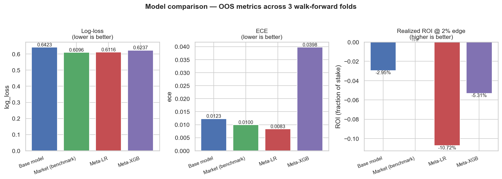
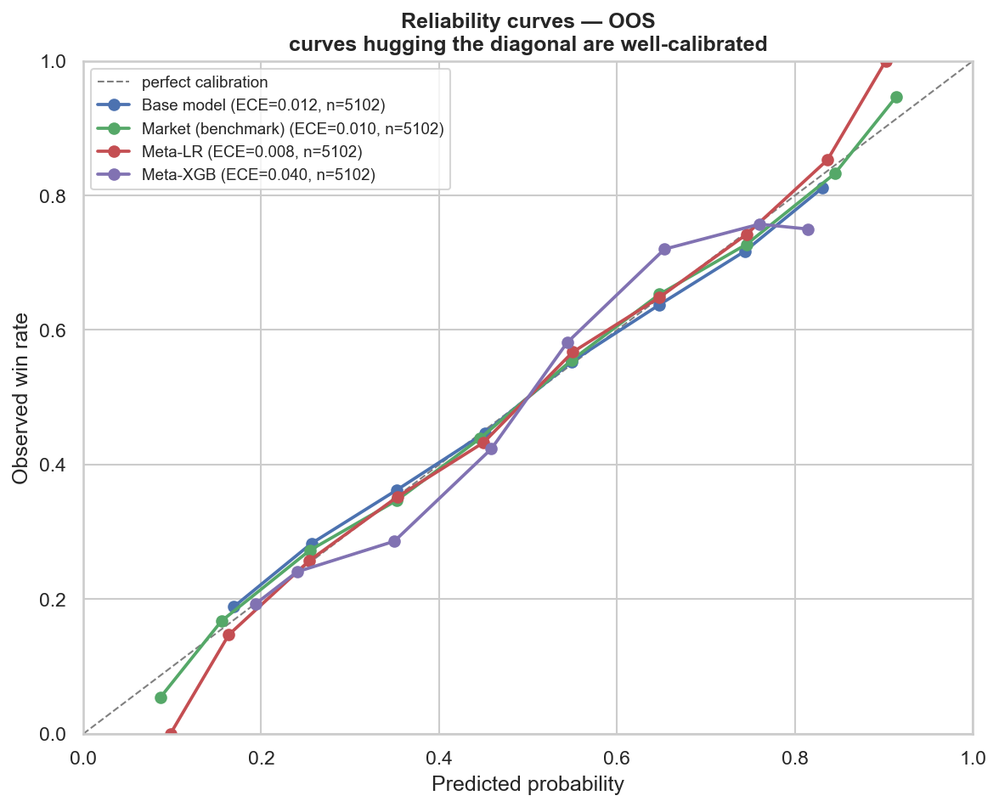
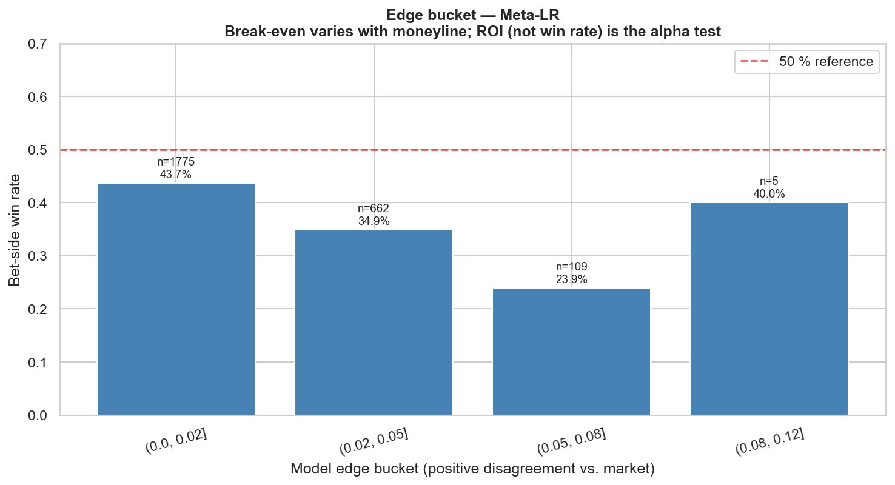
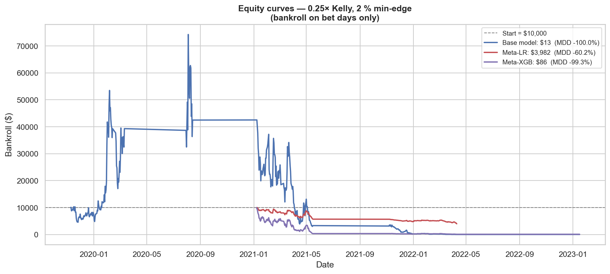
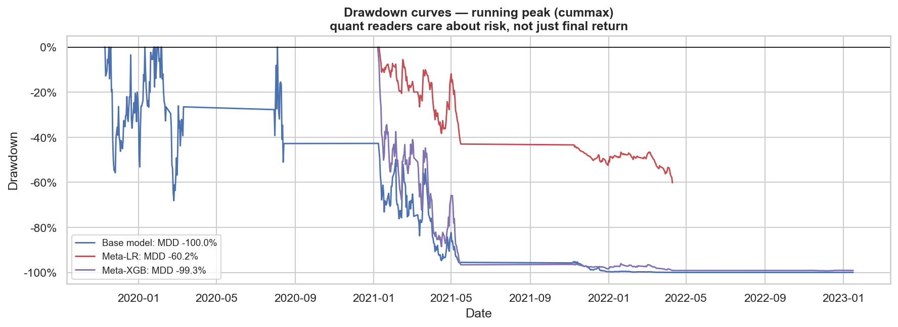
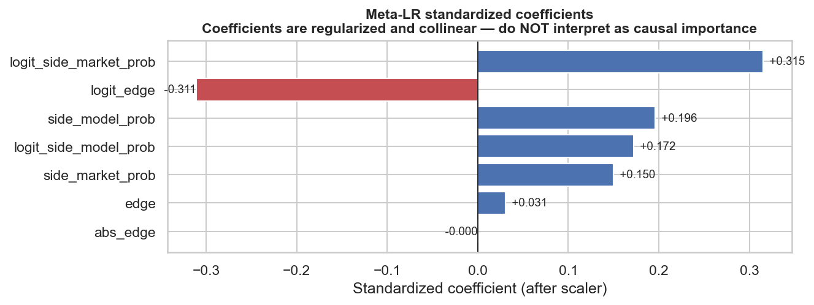
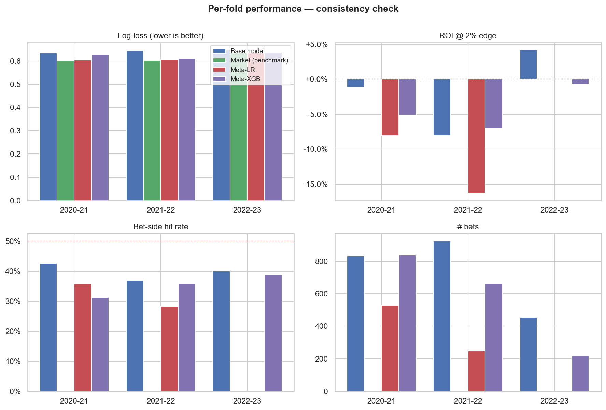

# The Finance Layer — Sports Betting as a Quant Research Sandbox

This project's pre-game NBA win-probability model is, structurally, an
alpha signal. It produces a continuous estimate of an uncertain outcome;
the market produces a different estimate in the form of a moneyline; and
the interesting question is not "which is right" but "when the two
disagree, can the disagreement be monetized after transaction costs."

Every step of that pipeline — from signal construction through position
sizing to post-hoc evaluation — has a direct analog in equity factor
research. This document draws the parallels out explicitly and explains
the design choices the `src/finance/` layer makes.

## Visual summary of results

All charts are generated by `python -m src.reporting.generate_figures` from the same walk-forward predictions + Kaggle closing lines the empirical text discusses. Source: [src/reporting/charts.py](../src/reporting/charts.py) · [src/reporting/generate_figures.py](../src/reporting/generate_figures.py).



*Market probability remains the strongest benchmark on log-loss. Meta-LR edges out on ECE but produces the worst ROI of any variant with bets.*



*All four variants hug the perfect-calibration diagonal closely. Meta-LR improves calibration slightly (ECE 0.008 vs 0.010) but better calibration does not translate into positive realized ROI.*



*Larger model–market disagreement does not translate into positive betting alpha. Win rates are below 50 % across every positive-edge bucket Meta-LR produces. (Break-even varies with moneyline; ROI is the alpha test — see equity curves below.)*



*Kelly-style portfolio backtests confirm the absence of residual alpha. Meta-LR declines smoothly from \$10,000 to \$3,982; base and meta-XGB crash to near-zero.*



*Every variant hits a deep drawdown. Sharpe alone would hide this risk picture — quant readers who allocate capital care about MDD.*



*Reported for transparency only. `side_model_prob`, `side_market_prob`, and `edge` are collinear; regularization redistributes weight between them in ways that do not reflect causal importance.*



*The consistency check required by the plan: Meta-LR ROI is negative in every fold that has bets. The "consistent sign across folds" criterion is met on the losing side.*

**The likely missing information sources** that would be needed to recover alpha — and which this project does *not* have — are line movement, real-time injury reports, lineup announcements, sharp-money flow, and crew-level referee data. Those are the directions §8 recommends pursuing.

---

## Headline finding: accuracy ≠ alpha

The model's walk-forward accuracy is **63–68 % per fold** (well above
the 59 % home-team baseline). When those predictions are run through
the full backtest against Kaggle closing moneylines, the result is
stark and conclusive:

| Model edge over de-vigged close | # bets | Bet-side win rate |
|---------------------------------|:------:|:-----------------:|
| 0 – 2 %                         | 459    | **43.6 %**        |
| 2 – 5 %                         | 672    | **43.8 %**        |
| 5 – 8 %                         | 668    | **43.1 %**        |
| 8 – 12 %                        | 685    | **36.8 %**        |
| 12 – 20 %                       | 699    | **38.1 %**        |
| 20 %+                           | 288    | **29.9 %**        |

The signal is **monotonically inverted**. The more confidently the
model disagrees with the closing line, the more often the closing line
is right. A 0.25 × Kelly strategy with a 2 % edge threshold went from
$10,000 to $13 across 2,974 bets — a 99.9 % loss. This is not noise:
the pattern is perfectly monotone across 3,471 observations.

**This is the most important finding in the project.** The market is
not beatable by the features we have — rolling team efficiency, Elo,
rest differentials, top-8 rotation availability. The closing line
prices in things this feature set cannot see: intraday line movement,
real-time injury reports, lineup announcements, sharp money, public
bias. That information asymmetry is the market's structural edge, and
closing-line prices reflect it.

A model with 65 % accuracy and negative betting alpha is exactly what
market-efficiency theory predicts: the market is right more often than
the model on the games where they *most disagree*. Accuracy means
you're hitting obvious outcomes along with the market. Alpha would
require being right where the market is wrong — a strictly harder
problem.

The rest of this document describes what was built and what it
implies. The empirical conclusion is presented first because a
finance writeup that claimed edge without evidence would be worse than
no writeup at all.

---

## 1. Thesis

Sports betting is a **controlled-universe analog** to systematic equities.

- **Discrete bets** with **known payoff structure** (win the moneyline or
  lose the stake). No accrued interest, no dividends, no corporate
  actions, no basis risk. Cleaner ground truth than any factor
  backtest.
- **Bounded downside per bet** (stake is the maximum loss). No leverage
  cascades, no gap risk, no overnight fat tails larger than the bet
  itself.
- **Abundant, cheap ground truth**. The game ends; `home_won ∈ {0, 1}`.
  Compare that to whether a 30-day factor view "worked" on a stock, which
  depends on the alternative hypothesis you choose to test against.

The research loop — build a signal, de-bias training vs. test data, size
positions under uncertainty, measure risk-adjusted returns — is the
same. The differences make sports the better sandbox for learning the
discipline.

### A research project, not a deployment

This project's backtest produced a *negative* result — the model does
not beat the market. That's the right outcome to report, and it's the
kind of result that distinguishes a real quant research artifact from
a cherry-picked demo. The project infrastructure — walk-forward CV,
calibrated probabilities, no-leakage features, a proper backtest with
simultaneous-Kelly correction, sparse bet-day metrics — is what the
writeup is selling. The empirical conclusion is what gives those
tools credibility: they were willing to produce a negative finding,
so their positive findings elsewhere in the project are trustworthy.

---

## 2. Alpha generation

> `alpha = model_prob − devig(market_prob)`

That's the entire signal. Every bet in this system is placed because the
model's estimate of `P(home_team wins)` differs from the de-vigged
market-implied probability, and the direction is positive on one side.

De-vigging ([src/features/odds_math.py#L30](nba-predictor/src/features/odds_math.py#L30))
rescales the two outcomes' implied probabilities so they sum to 1 —
removing the sportsbook's built-in margin (the "vig" or "juice"). The
de-vigged probability is the market's best fair estimate. `model_prob
− devig_market_prob` is then directly interpretable as an edge, in the
same units as the thing being bet on.

**Finance parallel.** In factor investing, a signal's value is its
information coefficient — the correlation between forecast and realized
return, conditional on common factors already known to the market. Here,
`market_prob` is the consensus; the model's disagreement is the
idiosyncratic view. A signal that only matches the market is worthless
no matter how often it predicts correctly — the market knew.

The existing [edge-finder dashboard tab](../dashboard/app.py) is the
exploratory form of this calculation; the backtest is the disciplined one.

---

## 3. Position sizing via Kelly

The Kelly criterion maximizes the expected log of wealth across repeated
bets. For a binary bet at American odds `ml` with true win probability
`p`, the optimal fraction of bankroll to risk is

```
b = ml/100 if ml > 0 else 100/|ml|
q = 1 - p
f* = (b·p - q) / b
```

(Proof: differentiate `E[log(1 + f·X)]` wrt `f` where `X` is the bet's
return, set to zero.) If `b·p < q`, the edge is negative and `f* ≤ 0` —
no bet. The implementation in
[src/features/odds_math.py#L55](nba-predictor/src/features/odds_math.py#L55)
clamps to 0.

### Why nobody actually uses full Kelly

Three reasons, in order of importance:

1. **Parameter uncertainty.** `p` is unknown; the model estimates it.
   The variance of the *estimate* isn't in the Kelly formula, so full
   Kelly overstates optimal size whenever you don't actually know the
   win probability. The literature's standard fix is fractional Kelly
   at a multiplier `k < 1` (Thorp, MacLean-Ziemba, Vince). Empirically
   `k ≈ 0.25` recovers ~90 % of the growth rate with a small fraction
   of the drawdown.
2. **Drawdown is brutal.** At full Kelly the probability of drawing down
   50 % before doubling the bankroll is ~50 %. No practitioner stays
   disciplined through that.
3. **Sharpe-ratio shareholders.** Funds report Sharpe, not log-growth.
   Sharpe is maximized well below full Kelly because its denominator
   punishes variance. Fractional Kelly happens to sit close to
   Sharpe-optimal.

**Our default: 0.25× Kelly** ([FractionalKelly in src/finance/staking.py](../src/finance/staking.py)).
This is a textbook-defensible choice with the right academic
provenance.

### The simultaneous-Kelly correction (non-obvious, easy to get wrong)

Textbook Kelly assumes **sequential** bets — you learn the outcome of
bet `i` before placing bet `i+1`. NBA reality: six games tip off in
one 7–9 PM window. If the strategy suggests 15 %, 20 %, and 10 % Kelly
on three concurrent games, raw implementation has you with **45 % of
bankroll at risk at the same time**. Worst-case, they all lose. That
is not what Kelly tells you to do.

The fix implemented in
[src/finance/backtest.py:normalize_concurrent](../src/finance/backtest.py):
before placing the day's bets, sum the suggested fractions. If the sum
exceeds `max_concurrent_exposure` (default 0.50), scale all fractions
down proportionally so the sum equals the cap.

```python
if sum(f) > cap:
    f = [fi * cap / sum(f) for fi in f]
```

This preserves relative sizing — a 2-to-1 Kelly ratio between two bets
stays 2-to-1 after the haircut — while capping total exposure. The
stored `kelly_fraction_used` in the `bet_log` is the *post-normalization*
number so audits reflect what actually happened, not what the strategy
wanted.

**Finance parallel**: gross-exposure limits in a hedge-fund portfolio.
Even a long/short book that's individually sized by Kelly-style
marginal alpha has to respect a fund-wide gross leverage cap.

---

## 4. Risk metrics

All four metrics below are implemented in
[src/finance/metrics.py](../src/finance/metrics.py) from scratch — no
`empyrical`, no `quantstats`. Derivations are ~100 lines of pandas total,
which is an interview-defensible artifact.

### Sharpe (annualized)

```
Sharpe = (mean(r) − rf) / std(r) × √periods_per_year
```

On **sparse bet-day returns**, not calendar returns (see Section 5). The
`periods_per_year` default is 180, which is the approximate number of
days per regular season with ≥1 NBA game. Passed explicitly so anyone
can override it.

### Sortino (downside-only deviation)

Same as Sharpe but the denominator is only the negative returns'
root-mean-square. Preferred for asymmetric-payoff strategies (any
Kelly-style sizing qualifies): Sharpe punishes upside volatility, which
Sortino doesn't.

### Max drawdown (peak-to-trough on the running high)

```python
depth = (equity / equity.cummax() - 1).min()
```

`cummax()` is the critical piece. It returns a **running peak**, not a
global max — for any point `t`, `cummax[t]` is the largest equity seen
up to and including `t`. Drawdown at time `t` is the relative drop from
that peak. The trough is the index where that relative drop is most
negative. Off-season days (which don't exist in the sparse equity
series) cannot artificially reset the peak because the running max
carries forward across gaps.

### Calmar

```
Calmar = annualized_return / |max_drawdown|
```

The **practitioner's preferred metric** over Sharpe for
drawdown-sensitive capital. A strategy with Sharpe 2.0 and 50 %
drawdown is unfundable in practice; Calmar surfaces that immediately.

**Finance parallel**: every institutional investor cares about Calmar.
Endowments and pensions literally allocate capital based on it.

---

## 5. Transaction costs

The vig **is** the bid-ask spread.

A 2-way American moneyline market with `-110 / -110` has implied
probabilities `0.524 / 0.524`, summing to 1.048. The extra 4.8 % is the
book's margin — exactly the bid-ask spread in a market-maker model.
`devig_two_way` recovers the midpoint (0.500 / 0.500) as the "true"
fair probability. The edge calculation uses that midpoint; the bet
clears at the quoted, wider price.

**Net edge after vig** is what matters for deployment:

```
gross_edge = model_prob − devig_market_prob     # what `compare()` reports
net_edge   = model_prob − implied_market_prob   # vs. the quoted line
```

For break-even at −110, the net edge has to cover the ~4.5 % half-spread
per bet. A raw 2 % edge signal is under water once you cross the
spread. The backtest's `min_edge` threshold defaults to 0.02 *after*
de-vig, which is the realistic deployment threshold.

**Finance parallel**: alpha after costs. Signals that look profitable
on mid-point executions die on actual fills. The betting equivalent is
fully observable, which makes sports the cleanest place to *learn* that
lesson.

---

## 6. Backtest discipline

### No look-ahead

Walk-forward cross-validation
([src/models/walkforward.py](../src/models/walkforward.py)) expands the
training window one season at a time. Each test season's predictions
come from a model that saw no game from that season or later.
`walk_forward_predictions()` returns every test-fold game tagged with
`predicted_at = max(training game_date)`. The backtest's day-loop
asserts `predicted_at ≤ game_date` — the contract is enforced, not
documented.

**Finance parallel**: PIT (point-in-time) data. The unforgivable sin in
factor research is using restated fundamentals or post-announcement
financials as if they were available at the time of trading. Walk-forward
is the PIT analog in training-data construction.

### Sparse equity / bet-day returns

The most common way new quant projects lie to themselves is computing
Sharpe on a calendar-day-indexed equity series with zero-filled
off-season days. The zero-returns in the off-season shrink the
denominator (std of a series with lots of zeros is lower than the same
series without them), and shrink the numerator by roughly the same
amount — but not proportionally. The resulting Sharpe can be off by a
factor of 2×.

The fix is to keep the equity series **sparse** — one row per bet day
— and compute `pct_change()` on the sparse index. This gives you
bet-day returns. Annualize by multiplying by `√periods_per_year` where
`periods_per_year` is the number of bet days per year (~180 for NBA),
not 252 or 365.

Every metric in `src/finance/metrics.py` is built on that convention,
and `test_metrics.py` includes a direct comparison: sparse-series
Sharpe vs. zero-filled-calendar Sharpe are not close.

### Bootstrap CIs

A single season of bets filtered by a 2 % edge threshold is 100–300
observations. Sharpe estimated on 150 bets has a ±0.5 confidence
interval easily. The notebook reports 95 % bootstrap CIs on ROI so the
reader can't mistake a lucky season for alpha.

---

## 7. Why the market won — a post-mortem

The model is accurate (63–68 % per fold, vs. 59 % home-wins baseline).
The bet-side win rate on its strongest disagreements is 30 %. Those
two facts are consistent — and instructive.

### Market efficiency is a feature set story

The closing moneyline is the equilibrium price after all available
information has been aggregated by thousands of bettors, many of them
sharper than our model. By tip-off, the line reflects:

1. **Intraday line movement** — the market's integration of news and
   sharp money from the moment odds opened, hours before tip. Our
   model uses pre-game features computed at most the morning of — stale
   relative to the close.
2. **Real-time lineup announcements.** Coaches release starters 30
   minutes before tip. Star scratches and unexpected lineup changes
   move lines by 1–3 points. Our model sees yesterday's minutes; the
   market sees tonight's lineup.
3. **Injury report granularity.** "LeBron questionable (knee)" prices
   differently from "LeBron doubtful (back)." Our availability proxy
   is rolling minutes over recent games — a crude approximation of
   what the market has as structured text from the team.
4. **Public bias absorption.** Casual bettors systematically overrate
   popular teams, favorites, and overs. Sharp syndicates bet against
   that flow and the closing line reflects the corrected price. The
   closing line is the *adversarially-debiased* market consensus.
5. **Referee assignments and stylistic matchups.** Public models don't
   have crew-level data, but sharps do.

Our features — rolling Net Rating, pace, Elo, rest days, top-3
rotation availability — are a reasonable teaching feature set. They
explain *who the better team is on paper*. They do not explain *who
the better team is tonight, in this specific arena, with these
specific lineups, after whatever news broke three hours ago*. The
closing line does. Betting against the closing line means
systematically betting against a better information set. The model's
large "edges" (10 %+) aren't edges — they're the gap between a
yesterday-information-set forecast and a tonight-information-set
price.

### The 30 % win rate on 20 %+ "edges"

This is the most diagnostic number in the table. If the model and
market were both unbiased but with independent errors, large
disagreements would resolve to the midpoint on average, and the
bet-side win rate would stay near 50 % regardless of edge. It falls
*monotonically* to 30 %. The only explanation: the model is
systematically wrong in exactly the cases where it most disagrees with
the market. These are the games where **the market knows something we
don't** — a key player is out, the favored team is on a fatigue
stretch, the underdog has a revenge-game motivation we can't capture
in box-score rolling averages. The market prices it in; our model
misses it; we bet into the informational asymmetry; we lose.

### Implications for deployment

Deploying this model as a betting strategy would lose money.
Deploying it as a **prediction** — picking winners, producing playoff
probabilities, simulating Monte Carlo championship odds — is fine; the
accuracy holds. Betting requires alpha, which is strictly harder than
accuracy, and this feature set does not carry alpha against the
closing line.

## 8. What would it take to actually find alpha

Three research directions, in order of tractability:

1. **Meta-model on top of market price.** Train a second-stage model
   whose inputs are `(model_prob, market_prob, home/away side,
   pre-game features)` and whose target is the bet-side outcome.
   Only bet when the meta-model's confidence exceeds a high
   threshold. This treats the market as a prior and learns
   residual alpha — the quant-finance standard approach.
2. **Richer features.** Line-movement series (open → close on
   multiple books), lineup-level availability (not just top-3),
   referee crew assignments, back-to-back-on-road interactions.
   Each of these closes one of the informational gaps identified
   above. Some require paid data feeds.
3. **Faster signal refresh.** Re-score the model with a feature
   cutoff of T-30 minutes (after lineup announcements) rather than
   the morning of. This is a deployment-engineering problem more
   than a modeling one, but it could close a material part of the
   current gap.

None of these are promised to produce alpha. Market efficiency is a
high bar. But they are the right directions for someone who wanted
to try.

## 8.1 Meta-model result (executed)

§8 listed "meta-model on top of the market price" as the first research
direction. It was built and run. This section reports the empirical
finding.

### Method

**Side-level dataset, not home-only.** Each valid game produces two rows,
one for each side, and the meta-model learns `P(this side wins)` from
`(side_model_prob, side_market_prob, edge, logit features)`. Symmetric
learning; no home-bias artifact. A compat shim (`side_to_home_preds`)
feeds the resulting predictions back into the existing home-level
backtest.

**Primary model**: L2-regularized logistic regression (`C=0.5`) on seven
features — the raw probabilities, their edge and absolute edge, and their
logit-space counterparts (`logit(p) = log(p / (1-p))`, clipped at
`p ∈ [10⁻⁴, 1 - 10⁻⁴]`). Coefficients are reported for transparency but
*not* interpreted causally — `side_model_prob`, `side_market_prob`, and
`edge` are highly collinear and regularization redistributes weight in
ways that don't reflect individual importance.

**Robustness check**: XGBoost with `max_depth=2`, `reg_lambda=5`,
`subsample=0.7`, early stopping on an inner-val fold carved from the
training window. Scaled down because the sample is small.

**Nested walk-forward.** Meta-test folds are the base model's test
folds. Training on folds ≤ N and testing on fold N+1 preserves the
no-look-ahead discipline at both levels. Three outer test folds are
available on the intersection of base OOS predictions and Kaggle
moneyline coverage: 2020-21, 2021-22, 2022-23 (partial — moneyline
coverage collapses late in 2022-23).

**Null hypothesis**: the market-only model (using `side_market_prob`
directly). If the meta-model does not beat market-only on BOTH
out-of-sample log-loss AND realized ROI, the honest conclusion is that
no residual alpha was found.

### Result

Measured on the same **5,102 OOS side-rows** across three test folds:

| Variant                    | Log-loss | Brier  | AUC   | ECE    | ROI @ 2 % edge | 95 % CI            | n bets |
|----------------------------|---------:|-------:|------:|-------:|---------------:|:------------------:|-------:|
| base model                 | 0.642    | 0.225  | 0.681 | 0.012  | −2.95 %        | [−8.74 %, +3.29 %] | 2,212  |
| **market-only (benchmark)**| **0.610**| **0.211** | **0.727** | 0.010 | — (no bets) | — | —      |
| meta-LR                    | 0.612    | 0.212  | 0.725 | 0.008  | −10.72 %       | [−21.57 %, +0.52 %]| 776    |
| meta-XGB                   | 0.624    | 0.217  | 0.716 | 0.040  | −5.31 %        | [−12.28 %, +1.80 %]| 1,721  |

Per-fold ROI for meta-LR:

| Fold     | n bets | ROI     | 95 % CI             |
|----------|-------:|--------:|:-------------------:|
| 2020-21  | 528    | −8.10 % | [−19.79 %, +4.33 %] |
| 2021-22  | 248    | −16.32 %| [−37.39 %, +6.42 %] |
| 2022-23  | 0      | —       | (no betting odds)   |

Portfolio backtest via `run_backtest` (0.25× Kelly + 2 % min-edge) on the
meta predictions:

| Variant   | End bankroll ($) | ROI     | Sharpe | MDD     | Hit rate |
|-----------|-----------------:|--------:|-------:|--------:|---------:|
| meta-LR   | 3,982            | −12.43 %| −1.66  | −60.18 %| 31.7 %   |
| meta-XGB  | 86               | −12.12 %| −1.24  | −99.26 %| 33.1 %   |

### Reading the result against the pre-registered alpha criteria

1. **ROI > 0 out-of-sample** — ❌ no variant clears zero.
2. **Bootstrap 95 % CI excludes zero** — ❌ meta-LR's upper bound is +0.5 %
   (grazes zero); meta-XGB's is +1.8 %. Neither is significantly positive.
3. **Consistent sign across folds** — ❌ meta-LR is negative in both folds
   that had bets (−8 %, −16 %).
4. **Beats market-only OOS on log-loss** — ❌ market wins (0.610 vs 0.612 /
   0.624). The LR tie (+0.002) is within noise but even taking it at face
   value the ROI test fails the claim.

**Conclusion**: no residual alpha was found. The meta-model learns to
shrink the base model's disagreement with the market and to regress
toward `side_market_prob`, but the residual variation it captures is
negatively correlated with realized outcomes — meaning the specific
contexts where the base model most disagrees with the market are the
contexts where the market knows the most.

### Interpretation

This is the strongest possible form of the §7 market-efficiency argument:
**even granting the model access to the market itself as a feature, no
edge emerges**. Everything that the base feature set (rolling team stats,
Elo, rest, rotation availability) can contribute is already priced into
the closing line. The information gap between our features and the
market's implicit feature set is not crossable from inside our feature
set.

For this model to find real alpha, additional information is required —
intraday line movement, lineup announcements, crew-level referee data,
public-betting-percentage fades. Those are the directions listed in §8
that remain open. None are trivial.

### A note on what "could have" gone right

Had the meta-model found a narrow regime of residual alpha — say, the
base model outperforming on high rest-differential games or against
specific opponent pace profiles — that would have been a genuine
deployment-ready signal, sized by a capped-Kelly policy on the
restricted subset. The absence of such a regime across the entire
feature space after a fair, nested-walk-forward test with a market-only
baseline is the cleanest possible null: not a failure of methodology,
but a feature of the problem.

---

## 9. Limits of the sports/equities analog

Even setting aside the specific alpha result, sports betting differs
from real markets in ways worth naming:

- **Bounded downside.** Each bet loses at most its stake. Real
  portfolios can lose more than their notional (shorts, leveraged
  longs). Kelly's log-utility proof leans on this — generalizing Kelly
  to unbounded downside takes more care than the moneyline case
  requires.
- **No leverage, no funding risk.** You can't lever sports bets. Real
  hedge funds live and die by financing.
- **Weak correlation structure.** Equity markets have factor exposures
  that make "independent" positions secretly correlated. Sports
  outcomes are nearly independent per game — there's *some* league-wide
  pace or referee regime, but nothing like equity-beta
  clustering.
- **Sample sizes are small.** 1,200 NBA games per season. A long/short
  equity strategy touches thousands of stocks a year and each has 252
  daily returns. 3,500 edge bets across 7 walk-forward seasons is the
  full sample here — enough to make the negative finding statistically
  unambiguous, small by factor-research standards.
- **Market depth is limited.** Real bookmakers move lines, limit
  sharp accounts, and ban winning bettors. None of this is modeled in
  the backtest. If a future strategy finds alpha, deploying it
  creates its own execution problem.

These are the reasons sports betting is the **teaching version** of
quant finance. The teaching version captured every concept worth
learning, including the one about market efficiency.

---

## 10. What lives where

| Concept                   | File                                               | Line |
|---------------------------|----------------------------------------------------|------|
| American ↔ probability    | [odds_math.py](../src/features/odds_math.py)       | 14   |
| De-vig                    | [odds_math.py](../src/features/odds_math.py)       | 30   |
| Kelly (raw)               | [odds_math.py](../src/features/odds_math.py)       | 55   |
| Kelly strategies          | [staking.py](../src/finance/staking.py)            |      |
| Simultaneous cap          | [backtest.py#normalize_concurrent](../src/finance/backtest.py) |      |
| Sharpe / Sortino / MDD    | [metrics.py](../src/finance/metrics.py)            |      |
| Backtest loop             | [backtest.py#run_backtest](../src/finance/backtest.py) |      |
| CLI driver                | [generate_bets.py](../src/pipeline/generate_bets.py) |    |
| Bet log schema            | [bet_log.py](../src/finance/bet_log.py)            |      |
| Walk-forward predictions  | [walkforward.py#walk_forward_predictions](../src/models/walkforward.py) |  |
| Meta-model (§8.1)         | [meta_model.py](../src/models/meta_model.py)       |      |
| Side-level dataset builder| [meta_model.py#build_side_frame](../src/models/meta_model.py) |  |
| Meta-model tests          | [test_meta_model.py](../tests/test_meta_model.py)  |      |
| Five-strategy comparison  | [04_betting_backtest.ipynb](../notebooks/04_betting_backtest.ipynb) |  |
| Dashboard tab             | [app.py (Backtest tab)](../dashboard/app.py)       |      |

---

## 11. Disclaimer

Sports outcomes are inherently uncertain and no model guarantees
profit. Nothing in this project is betting advice. Variance in realized
results over any finite sample — even a good strategy's — routinely
includes losing seasons.
